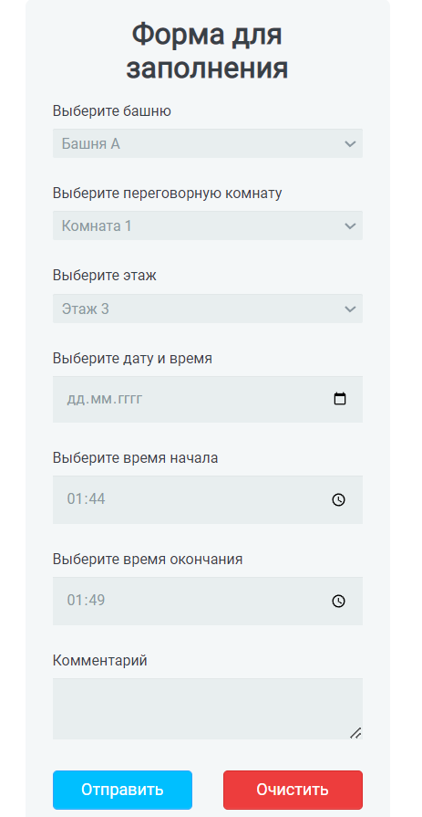

# Meeting room form
A simple form for reserving meeting room that shows the enetered data
in JSON format in console after clicking "Отправить" button. It also has
"Очистить" button for clearing the entered data

## Setup
This project doesn't include any package.json file so that
you can just click on index.html file, choose the browser you want it to view
and here we go now you can watch the meeting room form

## Author
Marian Roshchupkin &lt;roshchupkin.marian@gmail.com&gt;

Updated on: 7 May 2023

## License
MIT - see [LICENSE](LICENSE)
